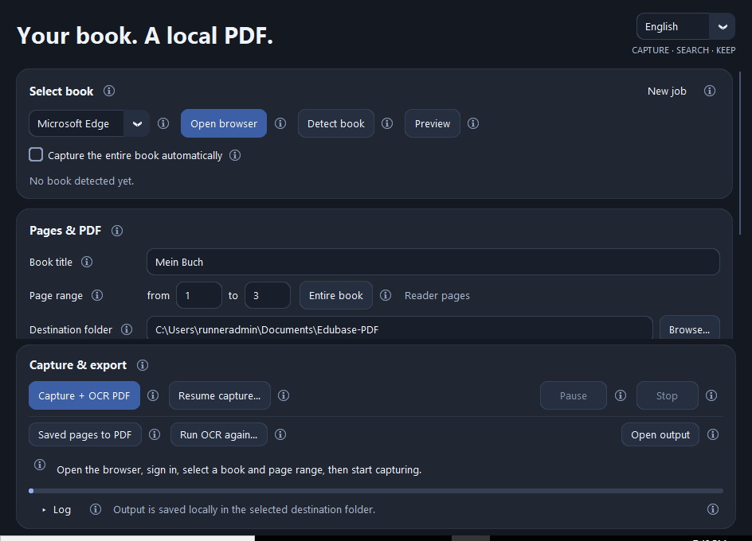

# Edubase to PDF + OCR

[Deutsch](#deutsch) · **[English below ↓](#english)**

**[Webseite & Download](https://sebii1998.github.io/edubase-to-pdf-ocr/)** ·
**[Website in English](https://sebii1998.github.io/edubase-to-pdf-ocr/en/)**

## Deutsch

**Dein Buch. Lokal als durchsuchbare PDF.**

Eine Windows-App, die deine Edubase-Buchseiten im Browser aufnimmt und daraus eine
durchsuchbare PDF erstellt. Mit automatischer Titelerkennung, einstellbarer
Buchseitennummerierung und optionaler Erkennung von Matheformeln.

### [⬇ Windows-App herunterladen](https://github.com/Sebii1998/edubase-to-pdf-ocr/releases/download/v1.6.0/Edubase-PDF-Windows.zip)

**Windows 64 Bit (Intel/AMD) · Version 1.6.0**

Python und Texterkennung sind enthalten. Nutze installiertes Edge oder Chrome;
Firefox ist im Paket enthalten. Keine separate Python-Installation nötig.

### Schnellstart

1. ZIP **vollständig entpacken** und **`Edubase-PDF.exe`** starten.
2. **Browser öffnen**, bei Edubase anmelden und das Buch in der **Einzelseitenansicht** öffnen.
3. Zuerst **Reader-Seiten 1–3** testen: **Vorschau** prüfen → **Aufnehmen + OCR-PDF**.

Die PDF liegt unter **`Dokumente/Edubase-PDF`**. Lesbarkeit und Textsuche prüfen;
danach über **Neuer Auftrag** einen grösseren Bereich oder das ganze Buch aufnehmen.
Während der Aufnahme nicht selbst blättern.

### Gut zu wissen

- **Am Schluss nur die PDF:** Nach erfolgreichem Export werden Arbeitsbilder und
  Zwischendateien automatisch gelöscht, auch bei einem Teilexport. Nach Stopp oder
  Fehler bleiben sie erhalten. Für späteres Fortsetzen **vor dem Export** unter
  **Erweiterte Einstellungen → Arbeitsbilder behalten** den Haken setzen.
- **Ganzes Buch:** Für einen automatischen Export vor **Browser öffnen** den Haken
  **Ganzes Buch automatisch aufnehmen** setzen. Beim Start ist er ausgeschaltet.
- **Früher fertig:** **Stoppen → Bisherige Seiten als PDF** exportiert bereits aufgenommene Seiten.
- **Mathe optional:** **Mathe-OCR einrichten** lädt das Zusatzmodul (ca. 575 MB).
  Danach **Mathe & Formeln erkennen** aktivieren. Erkannte Formeln werden als LaTeX
  in **PDF-Anhängen** gespeichert. Ergebnisse prüfen; die App löst keine Aufgaben.
- **Deutsch / English:** Auswahl oben rechts; Start immer auf Deutsch.
  Die kleinen **ⓘ** erklären die Funktionen.

**🎬 Ein YouTube-Tutorial ist geplant.**

[Anleitung](docs/ANLEITUNG.md) ·
[Mathe-Zusatzmodul](https://github.com/Sebii1998/edubase-to-pdf-ocr/releases/download/v1.6.0/Edubase-Mathe-OCR-Windows.zip) ·
[Alle Downloads](https://github.com/Sebii1998/edubase-to-pdf-ocr/releases/tag/v1.6.0) ·
[Fehler melden](https://github.com/Sebii1998/edubase-to-pdf-ocr/issues)

Nutze oben **Windows-App herunterladen**. GitHubs **Code → Download ZIP** und
**Source code** enthalten hier nur die öffentliche Dokumentation, nicht die App.

*Windows-App ohne digitale Signatur. Die Verarbeitung erfolgt lokal.
Unabhängiges Projekt; nutze nur Inhalte, auf die du zugreifen und die du speichern darfst.*

---

## English

**Your book. A local, searchable PDF.**

A Windows app that captures your Edubase book pages in the browser and turns them
into a searchable PDF. Includes automatic book titles, configurable PDF page labels
and optional maths recognition.

### [⬇ Download the Windows app](https://github.com/Sebii1998/edubase-to-pdf-ocr/releases/download/v1.6.0/Edubase-PDF-Windows.zip)

**Windows 64-bit (Intel/AMD) · Version 1.6.0**

Python and text recognition are included. Use installed Edge or Chrome;
Firefox is bundled. No separate Python installation needed.

### Quick start

1. **Extract the entire ZIP** and launch **`Edubase-PDF.exe`**.
2. Select **English** at the top right. Click **Open browser**, sign in to Edubase
   and open your book in **single-page view**.
3. Test **Reader pages 1–3** first: check the **Preview** → **Capture + OCR PDF**.

Find your PDF in **`Documents/Edubase-PDF`**. Check readability and text search,
then use **New job** to capture a larger range or the whole book.
Do not turn pages manually while capturing.

### Good to know

- **Only the PDF remains:** Working images and temporary files are deleted after
  a successful export, including partial exports. Errors or stopping preserve them.
  To resume later, enable **Advanced settings → Keep working images**
  **before exporting**.
- **Whole book:** For automatic export, enable **Capture the entire book automatically**
  before clicking **Open browser**. This option starts switched off.
- **Finish early:** **Stop → Saved pages to PDF** exports the pages already captured.
- **Optional maths:** **Set up math OCR** downloads the add-on (about 575 MB).
  Then enable **Recognise maths & formulas**. Recognised formulas are saved as
  LaTeX in **PDF attachments**. Check the results; the app does not solve exercises.
- **German / English:** Switch at the top right; every launch starts in German.
  The small **ⓘ** icons explain the controls.

**🎬 A YouTube tutorial is planned.**

[Guide (German)](docs/ANLEITUNG.md) ·
[Maths add-on](https://github.com/Sebii1998/edubase-to-pdf-ocr/releases/download/v1.6.0/Edubase-Mathe-OCR-Windows.zip) ·
[All downloads](https://github.com/Sebii1998/edubase-to-pdf-ocr/releases/tag/v1.6.0) ·
[Report an issue](https://github.com/Sebii1998/edubase-to-pdf-ocr/issues)

Use **Download the Windows app** above. GitHub's **Code → Download ZIP** and
**Source code** contain only the public documentation here, not the app.

*Unsigned Windows app. Processing runs locally.
Independent project; only use content you can access and are permitted to save.*

---

[MIT License](LICENSE) · [Third-party notices](THIRD_PARTY_NOTICES.md)
