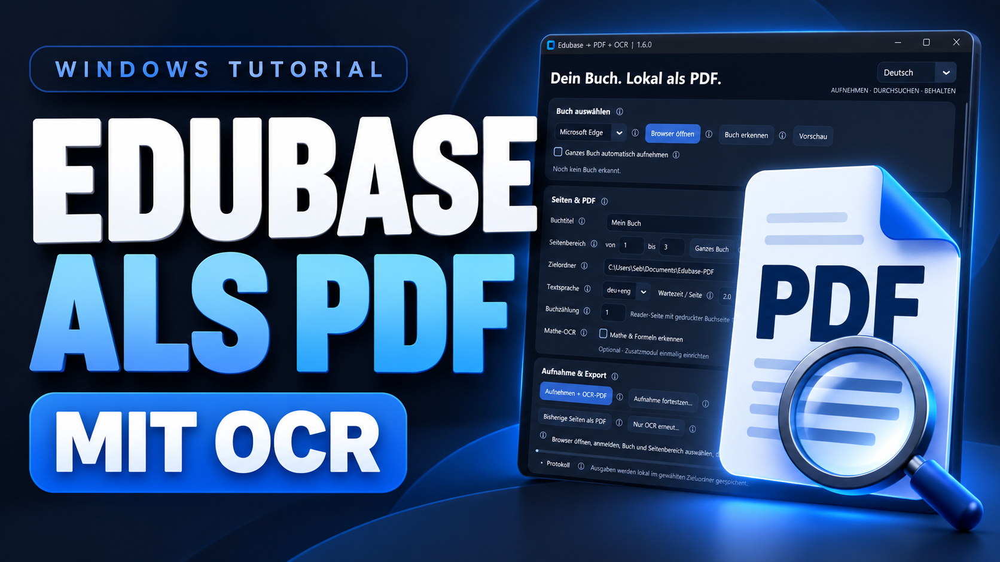
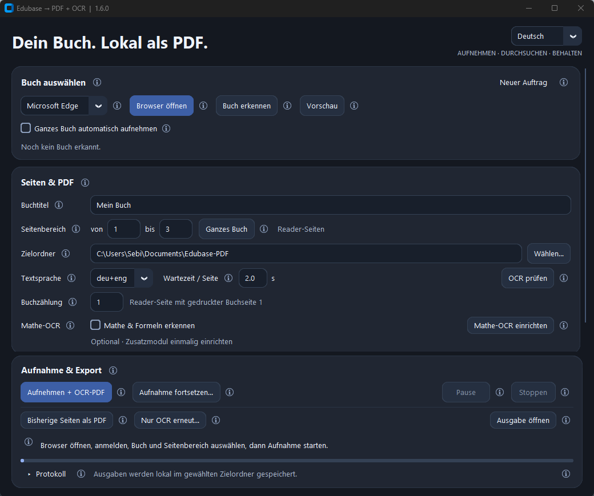
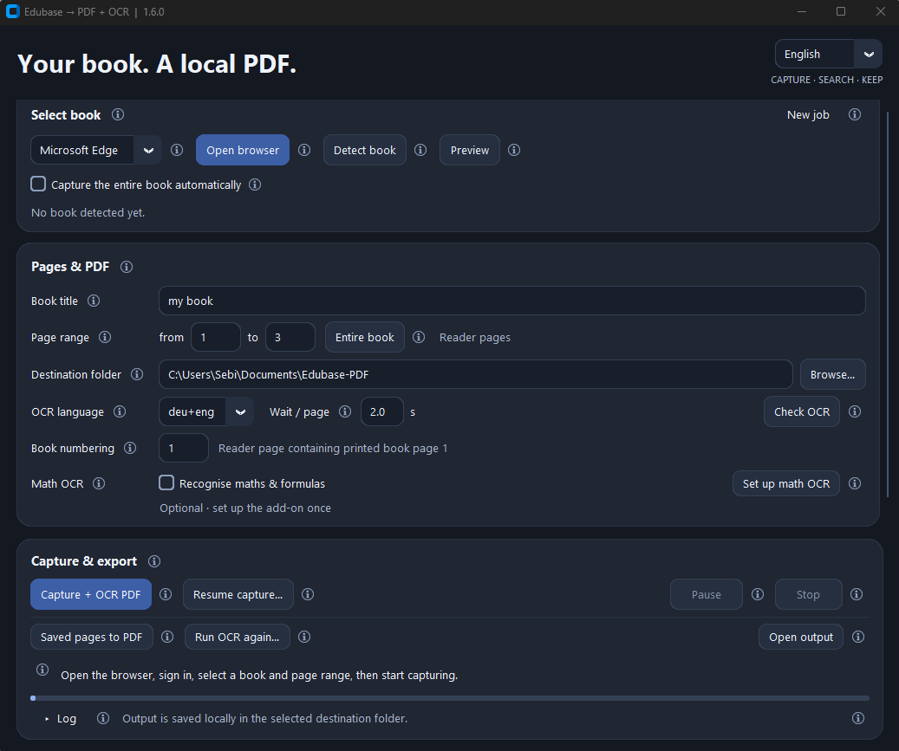

<h1 align="center">Edubase to PDF + OCR</h1>

  <strong>Dein Buch. Lokal als durchsuchbare PDF.</strong> 
  Your book. A local, searchable PDF.

  

  <strong><a href="https://sebii1998.github.io/edubase-to-pdf-ocr/">Webseite öffnen</a> · <a href="https://sebii1998.github.io/edubase-to-pdf-ocr/en/">Visit the English website</a> · <a href="https://www.youtube.com/watch?v=0XhHn8oYu90">▶ YouTube-Tutorial</a></strong>

  
  
  

  <a href="#deutsch">Deutsch</a> · <strong><a href="#english">English below ↓</a></strong>

---

## Deutsch

**Edubase to PDF + OCR** hilft dir, Edubase-Buchseiten als **durchsuchbare PDF** lokal zu speichern. So kannst du deine Lernunterlagen offline nutzen und langfristig in deinem persönlichen Archiv aufbewahren – auch wenn der Edubase-Reader später verändert oder eingestellt wird.

Nach deiner Anmeldung im Edubase-Reader nimmt die Windows-App die angezeigten Seiten des ausgewählten Buches automatisch als Bilder auf. Daraus erstellt sie auf deinem PC eine PDF und ergänzt mit Texterkennung (OCR) durchsuchbaren Text. Die aufgenommenen Buchseiten werden dabei nicht auf GitHub hochgeladen.

Automatische Titelerkennung, einstellbare Buchseitennummerierung und optionale Mathe-Erkennung ergänzen den Export.

> **Für persönlichen Gebrauch und Archivierung:** Speichere nur Inhalte, auf die du zugreifen und die du speichern darfst. Das Projekt ist nicht für unerlaubte Weitergabe, Piraterie oder andere rechtswidrige Zwecke bestimmt.

  

[ZIP · ca. 243 MB](https://github.com/Sebii1998/edubase-to-pdf-ocr/releases/download/v1.6.0/Edubase-PDF-Windows.zip) · [Alle Downloads](https://github.com/Sebii1998/edubase-to-pdf-ocr/releases/tag/v1.6.0)

**Windows 64 Bit (Intel/AMD).** Python, Texterkennung und Firefox sind enthalten.
Installiertes Edge oder Chrome werden ebenfalls unterstützt.

> Die fertige App findest du über den Download oben. **Code → Download ZIP** und **Source code** enthalten nur die öffentliche Dokumentation.

### Video-Anleitung

   
  

<strong>App-Oberfläche ansehen</strong>

  

### In drei Schritten starten

1. **Entpacken:** ZIP vollständig entpacken und **`Edubase-PDF.exe`** starten.
2. **Buch öffnen:** **Browser öffnen** → bei Edubase anmelden → Buch in der **Einzelseitenansicht** öffnen.
3. **Drei Seiten testen:** Reader-Seiten **1–3** wählen, **Vorschau** prüfen und **Aufnehmen + OCR-PDF** starten.

Deine PDF liegt standardmässig unter **`Dokumente/Edubase-PDF`**. Lesbarkeit und Textsuche prüfen;
danach über **Neuer Auftrag** einen grösseren Bereich oder das ganze Buch aufnehmen.
Während der Aufnahme nicht selbst blättern.

> **Leistung wählen:** Unter **Erweiterte Einstellungen → OCR-Leistung** bleibt **Automatisch** wie bisher. **CPU – maximale Leistung** nutzt mehr CPU-Leistung für Text- und Mathe-OCR; Textseiten werden passend zu CPU und Arbeitsspeicher parallel verarbeitet. **GPU verwenden** beschleunigt Mathe-OCR mit eingerichtetem GPU-Modul und unterstützter Grafikkarte. Der Geschwindigkeitsgewinn hängt vom Gerät ab.

| Funktion | Das bringt sie dir |
| --- | --- |
| **PDF + OCR** | Buchseiten mit durchsuchbarem Text; Verarbeitung lokal auf deinem PC. |
| **Flexible Aufnahme** | Seitenbereich wählen, pausieren oder bereits aufgenommene Seiten exportieren. |
| **Buchseitennummern** | Einstellen, welche Reader-Seite der gedruckten Buchseite 1 entspricht. |
| **Mathe optional** | Formeln durchsuchen; LaTeX-Anhang separat wählbar. |

> **Am Schluss bleibt nur die PDF.** Nach erfolgreichem Export werden Arbeitsbilder und Zwischendateien gelöscht – auch bei einem Teilexport. Möchtest du später fortsetzen, aktiviere **vor dem Export** unter **Erweiterte Einstellungen → Arbeitsbilder behalten** den Haken.

<strong>Aufnahme, Fortsetzen und Sprache</strong>

- **Ganzes Buch:** Vor **Browser öffnen** den Haken **Ganzes Buch automatisch aufnehmen** setzen. Beim Start ist er ausgeschaltet.
- **Früher fertig:** **Stoppen → Bisherige Seiten als PDF** exportiert bereits aufgenommene Seiten.
- **Fortsetzen:** Nach Stopp oder Fehler bleiben Arbeitsdateien erhalten. Über **Aufnahme fortsetzen…** den Auftrag wieder öffnen.
- **Deutsch / English:** Auswahl oben rechts; die App startet immer auf Deutsch. Die kleinen **ⓘ** erklären die Funktionen.
- **Buchzählung:** Der eingestellte Versatz passt die PDF-Seitenlabels an. Unnummerierte Einschübe werden damit nicht automatisch erkannt.

<strong>Mathe & Formeln erkennen – optional</strong>

**Mathe-OCR einrichten** lädt das Zusatzmodul (ca. 575 MB).
Danach **Mathe & Formeln erkennen** aktivieren.

**GPU verwenden** beschleunigt ausschliesslich Mathe-OCR. **GPU-Modul einrichten**
lädt das DirectML-Modul für geeignete Intel-, AMD- und NVIDIA-Grafik.
Bei GPU-Problemen übernimmt die CPU. Im Modus **Automatisch** wird eine eingerichtete,
unterstützte GPU ebenfalls genutzt; sonst bleibt CPU-Reserve.

Erkannte Formeln werden als **unsichtbarer Suchtext** ergänzt; das Seitenbild bleibt unverändert.
Mit **Strg+F** z. B. nach `σ` oder `F/A` suchen. Komplexe Formeln werden vereinfacht;
Treffer hängen von Erkennung und PDF-Programm ab.

**LaTeX-Dateien zusätzlich als PDF-Anhang** ist separat wählbar und standardmässig aus.
Der Anhang enthält LaTeX und Seitenzuordnung zum Weiterverwenden und ist für Strg+F nicht nötig.
Ergebnisse prüfen; die App löst keine Aufgaben.

[Mathe-Zusatzmodul herunterladen](https://github.com/Sebii1998/edubase-to-pdf-ocr/releases/download/v1.6.0/Edubase-Mathe-OCR-Windows.zip)

**[Ausführliche Anleitung](docs/ANLEITUNG.md)** · [Fehler melden](https://github.com/Sebii1998/edubase-to-pdf-ocr/issues) · [Webseite](https://sebii1998.github.io/edubase-to-pdf-ocr/)

*Windows-App ohne digitale Signatur. Unabhängiges Projekt.*

---

## English

  

**[Visit the English website](https://sebii1998.github.io/edubase-to-pdf-ocr/en/)**

**Edubase to PDF + OCR** helps you save Edubase book pages locally as **searchable PDFs**. Keep your learning materials available offline and in your personal archive, even if the Edubase Reader changes or is discontinued in the future.

After you sign in to the Edubase Reader, the Windows app automatically captures the displayed pages of your selected book as images. It creates a PDF on your PC and uses optical character recognition (OCR) to add searchable text. The captured book pages are not uploaded to GitHub.

Automatic title detection, configurable PDF page labels and optional maths recognition complete the export.

> **For personal use and archiving:** Only save content you can access and are permitted to save. This project is not intended for unauthorised sharing, piracy or other unlawful purposes.

  

[ZIP · about 243 MB](https://github.com/Sebii1998/edubase-to-pdf-ocr/releases/download/v1.6.0/Edubase-PDF-Windows.zip) · [All downloads](https://github.com/Sebii1998/edubase-to-pdf-ocr/releases/tag/v1.6.0)

**64-bit Windows (Intel/AMD).** Python, text recognition and Firefox are included.
Installed Edge and Chrome are also supported.

> Get the app using the download above. **Code → Download ZIP** and **Source code** contain only the public documentation.

### Video tutorial

   
  

<strong>View the app interface</strong>

  

### Get started in three steps

1. **Extract:** Extract the entire ZIP and launch **`Edubase-PDF.exe`**. Select **English** at the top right.
2. **Open your book:** **Open browser** → sign in to Edubase → open your book in **single-page view**.
3. **Test three pages:** Select Reader pages **1–3**, check the **Preview** and click **Capture + OCR PDF**.

Your PDF is saved to **`Documents/Edubase-PDF`** by default. Check readability and text search,
then use **New job** to capture a larger range or the whole book.
Do not turn pages manually while capturing.

> **Choose performance:** Under **Advanced settings → OCR performance**, **Automatic** works as before. **CPU – maximum performance** uses more CPU resources for text and maths OCR, processing text pages in parallel according to your CPU and available memory. **Use GPU** accelerates maths OCR with the GPU module installed and a supported graphics card. Speed gains depend on your device.

| Feature | What it does |
| --- | --- |
| **PDF + OCR** | Book pages with searchable text, processed locally on your PC. |
| **Flexible capture** | Choose a page range, pause or export the pages already captured. |
| **Book page labels** | Set which Reader page contains printed book page 1. |
| **Optional maths** | Search recognised formulas; choose LaTeX attachments separately. |

> **Only the PDF remains.** Working images and temporary files are deleted after a successful export, including partial exports. To resume later, enable **Advanced settings → Keep working images before exporting**.

<strong>Capture, resume and language</strong>

- **Whole book:** Enable **Capture the entire book automatically** before clicking **Open browser**. This option starts switched off.
- **Finish early:** **Stop → Saved pages to PDF** exports the pages already captured.
- **Resume:** Stopping or an error preserves the working files. Open the job using **Resume capture…**.
- **German / English:** Switch at the top right; every launch starts in German. The small **ⓘ** icons explain the controls.
- **Book numbering:** The selected offset adjusts PDF page labels. It does not automatically detect unnumbered inserts.

<strong>Recognise maths & formulas – optional</strong>

**Set up math OCR** downloads the add-on (about 575 MB).
Then enable **Recognise maths & formulas**.

**Use GPU** accelerates math OCR only. **Set up GPU module** downloads the DirectML
module for compatible Intel, AMD and NVIDIA graphics. GPU failures fall back to
CPU. **Automatic** also uses a configured, compatible GPU; otherwise it leaves CPU headroom.

Recognised formulas are added as **invisible searchable text**; the page image stays unchanged.
Use **Ctrl+F** for e.g. `σ` or `F/A`. Complex formulas are simplified; results depend
on recognition and the PDF viewer.

**Also attach LaTeX files to the PDF** is a separate option, off by default.
Attachments contain LaTeX and page references for reuse and are not needed for Ctrl+F.
Check the results; the app does not solve exercises.

[Download the maths add-on](https://github.com/Sebii1998/edubase-to-pdf-ocr/releases/download/v1.6.0/Edubase-Mathe-OCR-Windows.zip)

**[Full guide (German)](docs/ANLEITUNG.md)** · [Report an issue](https://github.com/Sebii1998/edubase-to-pdf-ocr/issues) · [English website](https://sebii1998.github.io/edubase-to-pdf-ocr/en/)

*Unsigned Windows app. Independent project.*

---

  <a href="LICENSE">MIT License</a> · <a href="THIRD_PARTY_NOTICES.md">Third-party notices</a> · <a href="#edubase-to-pdf--ocr">↑ Nach oben / Back to top</a>

